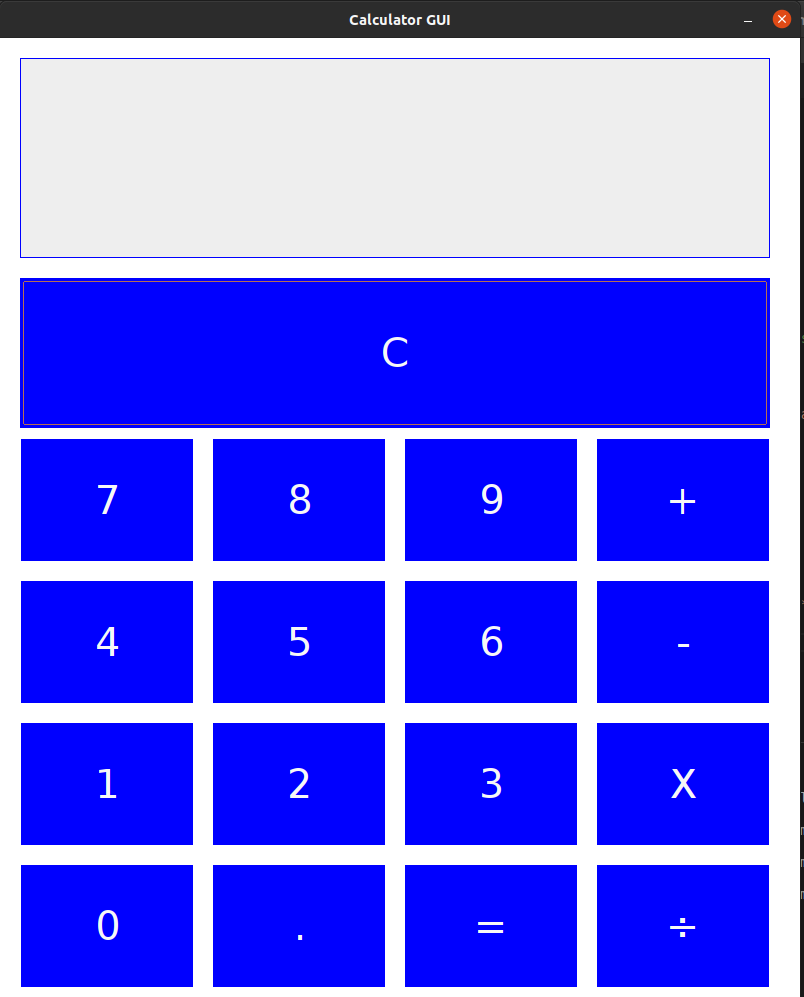

**In order to compile and run the program**     
    
*You have 2 ways.*    

**1. Way (Recommended):**  
First, enter the command to compile the program:  
```make```  
Then, enter the command to run the program:  
```make run```  

**2. Way:**   
First, enter the command to compile the program:  
```javac Main.java```    
Then, enter the command to run the program:  
```java Main```  


**Calculator Screen**  
  

